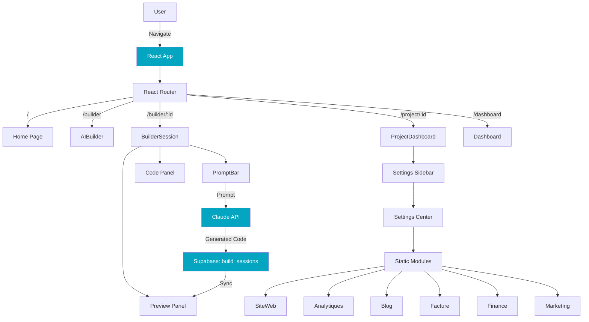
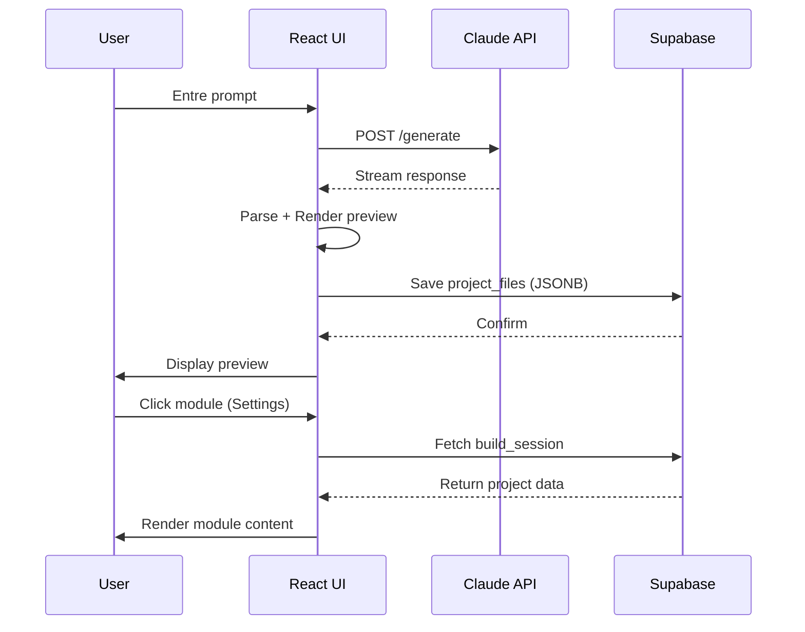
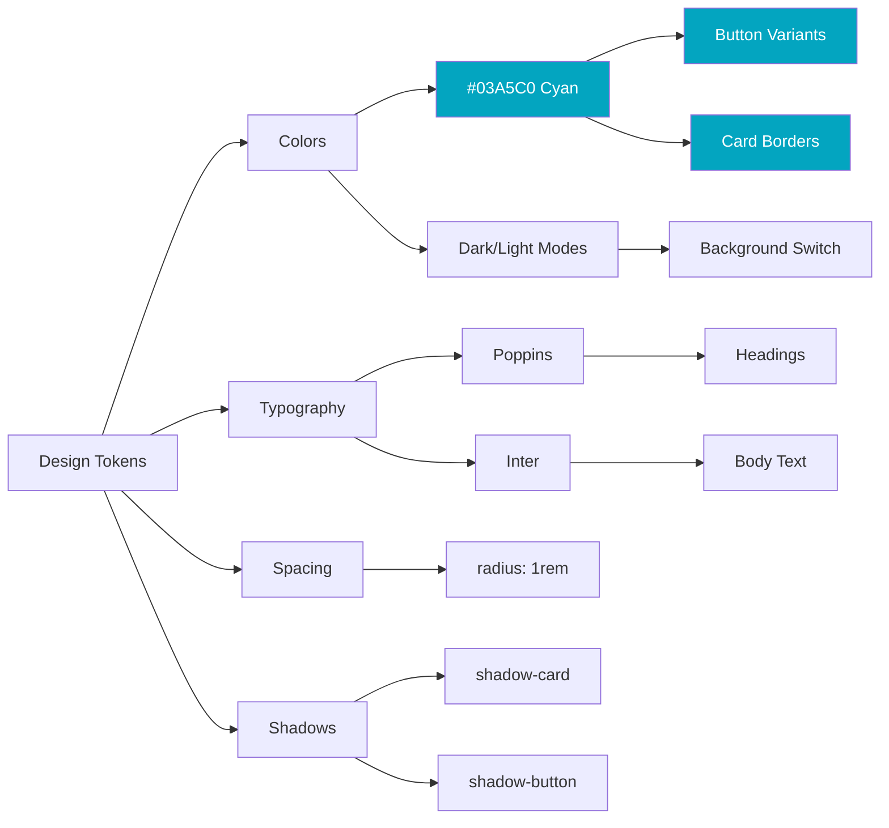

# 📊 Analyse d'Architecture - Magellan SaaS Evolution

**Date**: 23 Décembre 2025
**Objectif**: Transformer le builder de sites web actuel en plateforme intelligente avec génération automatique CRM/ERP par secteur

---

## 📋 Table des Matières

1. [Analyse de l'Existant](#1-analyse-de-lexistant)
2. [Design System & Direction Artistique](#2-design-system--direction-artistique)
3. [Architecture Technique Actuelle](#3-architecture-technique-actuelle)
4. [Structure de Données Supabase](#4-structure-de-données-supabase)
5. [Flux Utilisateur Actuel](#5-flux-utilisateur-actuel)
6. [Cartographie Visuelle](#6-cartographie-visuelle)

---

## 1. Analyse de l'Existant

### 1.1 Structure du Projet

```
magellanlabs/
├── src/
│   ├── components/
│   │   ├── builder/           # Builder session components
│   │   │   ├── ChatPanel.tsx
│   │   │   ├── CodePanel.tsx
│   │   │   └── PreviewPanel.tsx
│   │   ├── settings/          # Settings/Dashboard components
│   │   │   ├── SettingsCenter.tsx
│   │   │   ├── SettingsSidebar.tsx
│   │   │   └── sections/      # Modules actuels
│   │   │       ├── SiteWeb.tsx
│   │   │       ├── Analytiques.tsx
│   │   │       ├── Contact.tsx
│   │   │       ├── Blog.tsx
│   │   │       ├── Facture.tsx
│   │   │       ├── Finance.tsx
│   │   │       ├── Marketing.tsx
│   │   │       └── Parametres.tsx
│   │   ├── chat/              # Chat components
│   │   ├── ui/                # shadcn/ui components
│   │   └── PromptBar.tsx      # Barre de conversation
│   ├── pages/
│   │   ├── BuilderSession.tsx # Page principale du builder
│   │   ├── ProjectDashboard.tsx
│   │   ├── Dashboard.tsx
│   │   └── ...
│   ├── hooks/                 # Custom React hooks
│   ├── stores/                # Zustand state management
│   ├── services/              # Business logic
│   └── integrations/supabase/ # Supabase client
├── supabase/
│   ├── migrations/            # Database schema
│   └── functions/             # Edge functions
└── cloudflare-worker/         # Deployment automation
```

### 1.2 Stack Technique Actuelle

**Frontend**:
- ⚛️ React 18.3.1
- 📦 Vite (bundler)
- 🎨 Tailwind CSS 3.4.17
- 🧩 shadcn/ui (Radix UI components)
- 🔄 React Router 6.30.1
- 📊 Zustand (state management)
- 🔍 React Query (data fetching)

**Backend**:
- 🗄️ Supabase (PostgreSQL + Auth + Storage + Edge Functions)
- ☁️ Cloudflare Pages (hosting)
- 🤖 Claude API (Sonnet 4.5) pour génération IA

**Dépendances Clés**:
- Monaco Editor (éditeur de code)
- Sandpack (preview components)
- Babel (AST manipulation)
- html2canvas (screenshots)
- JSZip (export de fichiers)

### 1.3 Modules Actuels (Settings/Dashboard)

Les modules actuels sont des **composants statiques** dans `/components/settings/sections/`:

| Module | Icône | Fonctionnalité Actuelle |
|--------|-------|------------------------|
| **Site Web** | Globe | Gestion du site, domaine, SEO |
| **Analytiques** | BarChart3 | Cloudflare Web Analytics |
| **Contact** | Mail | Empty state (non implémenté) |
| **Blog** | FileText | Gestion de blog basique |
| **Facture** | Receipt | Création de factures |
| **Finance** | Wallet | Empty state (non implémenté) |
| **Marketing** | Megaphone | Barre de prompt marketing |
| **Paramètres** | Settings | Configuration projet |

> ⚠️ **Observation Importante**: Ces modules sont actuellement **identiques pour tous les secteurs**. Il n'y a pas de personnalisation par métier.

---

## 2. Design System & Direction Artistique

### 2.1 Couleurs Principales

**Magellan Cyan (Couleur Accent)**:
```css
--magellan-cyan: 187 97% 38%;       /* #03A5C0 - Primary cyan */
--magellan-cyan-light: 187 97% 48%; /* Lighter cyan for hover */
--magellan-cyan-dark: 187 97% 28%;  /* Darker cyan */
```

**Système de Couleurs**:
```css
/* Light Mode */
--background: 0 0% 100%;           /* Pure white */
--foreground: 0 0% 0%;             /* Pure black */
--card: 0 0% 100%;                 /* White cards */
--border: 0 0% 90%;                /* Neutral borders */
--primary: 187 97% 38%;            /* Magellan cyan */
--accent: 187 97% 38%;             /* Magellan cyan accent */
--ring: 187 97% 38%;               /* Focus rings */

/* Dark Mode */
--background: 0 0% 9%;             /* Neutral dark (ChatGPT-like) */
--foreground: 0 0% 98%;            /* Almost white */
--card: 0 0% 13%;                  /* Slightly lighter neutral */
--border: 0 0% 20%;                /* Dark borders */
--primary: 187 97% 38%;            /* Same cyan accent */
```

### 2.2 Typographie

```css
--font-poppins: 'Poppins', sans-serif;  /* Primary font */
--font-inter: 'Inter', sans-serif;      /* Secondary font */
```

### 2.3 Espacements & Formes

```css
--radius: 1rem;                    /* Border radius standard */
--radius-xl: 1.5rem;               /* Cards */

/* Shadows */
--shadow-trinity: 0 10px 40px -10px hsl(187 97% 38% / 0.25);
--shadow-card: 0 4px 20px -4px hsl(187 97% 38% / 0.15);
--shadow-button: 0 4px 12px -2px hsl(187 97% 38% / 0.3);

/* Transitions */
--transition-smooth: all 0.3s cubic-bezier(0.4, 0, 0.2, 1);
--transition-bounce: all 0.3s cubic-bezier(0.68, -0.55, 0.265, 1.55);
```

### 2.4 Composants UI Récurrents

**Cards avec Glassmorphism**:
```jsx
<Card className="rounded-[8px] border border-border/50 bg-background/50 shadow-sm">
  // Content
</Card>
```

**Boutons Accent Cyan**:
```jsx
<Button style={{
  borderColor: 'rgb(3,165,192)',
  backgroundColor: 'rgba(3,165,192,0.1)',
  color: 'rgb(3,165,192)'
}}>
```

**Background avec Cadrillage**:
```jsx
<div style={{
  backgroundImage: isDark
    ? 'linear-gradient(rgba(3, 165, 192, 0.03) 1px, transparent 1px), ...'
    : 'linear-gradient(rgba(3, 165, 192, 0.05) 1px, transparent 1px), ...',
  backgroundSize: '50px 50px'
}} />
```

---

## 3. Architecture Technique Actuelle

### 3.1 Routing (React Router)

```
/                        → Home (landing page)
/auth                    → Authentication
/dashboard               → User dashboard (liste projets)
/builder                 → Initial builder (nouveau projet)
/builder/:sessionId      → BuilderSession (éditeur principal)
/preview/:sessionId      → Preview fullscreen
/project/:projectId      → ProjectDashboard (vue projet)
/p/:subdomain            → PublicProject (site publié)
```

### 3.2 State Management (Zustand)

**themeStore.ts**:
```typescript
interface ThemeStore {
  isDark: boolean;
  toggleTheme: () => void;
}
```

> 📝 **Note**: État global minimal. La plupart de l'état est géré localement dans les composants avec `useState` et synchro avec Supabase.

### 3.3 BuilderSession Architecture

**Composant Principal**: `src/pages/BuilderSession.tsx`

**Structure**:
```
BuilderSession
├── ResizablePanelGroup (horizontal split)
│   ├── ResizablePanel (Code Panel)
│   │   ├── CodeTreeView (file explorer)
│   │   ├── FileTabs
│   │   └── MonacoEditor
│   └── ResizablePanel (Preview Panel)
│       ├── FakeUrlBar
│       ├── InteractivePreview (iframe)
│       └── GeneratingPreview (loading state)
├── PromptBar (bottom bar)
└── Chat Messages (scrollable)
```

**Flux de Génération**:
1. User entre un prompt dans `PromptBar`
2. Appel à `useGenerateSite()` hook
3. Génération via Claude API (streaming)
4. Mise à jour de `project_files` (JSONB)
5. Sync avec Supabase
6. Re-render du Preview

---

## 4. Structure de Données Supabase

### 4.1 Schéma Actuel

```sql
-- Table principale pour les projets/sessions
CREATE TABLE public.build_sessions (
  id UUID PRIMARY KEY DEFAULT gen_random_uuid(),
  user_id UUID REFERENCES auth.users(id),

  -- Métadonnées
  title TEXT,
  project_type TEXT DEFAULT 'website'
    CHECK (project_type IN ('website', 'webapp', 'mobile')),
  project_icon TEXT,  -- URL Supabase Storage

  -- Contenu du projet
  project_files JSONB DEFAULT '[]'::jsonb,
  -- Structure: [{path: string, content: string, type: string}]

  messages JSONB DEFAULT '[]'::jsonb,
  -- Historique de conversation

  -- Déploiement
  public_url TEXT,
  cloudflare_deployment_url TEXT,
  cloudflare_project_name TEXT,
  thumbnail_url TEXT,  -- Screenshot
  web_analytics_site_token TEXT,

  -- Timestamps
  created_at TIMESTAMP WITH TIME ZONE DEFAULT now(),
  updated_at TIMESTAMP WITH TIME ZONE DEFAULT now()
);

-- Table pour les domaines personnalisés
CREATE TABLE custom_domains (
  id UUID PRIMARY KEY,
  user_id UUID REFERENCES auth.users(id),
  session_id UUID REFERENCES build_sessions(id),
  domain TEXT NOT NULL UNIQUE,
  cloudflare_project_name TEXT NOT NULL,
  status TEXT DEFAULT 'pending' CHECK (status IN ('pending', 'active', 'failed')),
  dns_verified BOOLEAN DEFAULT false,
  method TEXT CHECK (method IN ('automatic', 'manual')),
  provider_name TEXT,
  created_at TIMESTAMPTZ DEFAULT NOW()
);

-- Table pour les profils utilisateurs
CREATE TABLE profiles (
  id UUID PRIMARY KEY REFERENCES auth.users(id),
  email TEXT NOT NULL,
  created_at TIMESTAMP WITH TIME ZONE DEFAULT now(),
  updated_at TIMESTAMP WITH TIME ZONE DEFAULT now()
);
```

### 4.2 Structure `project_files` (JSONB)

```json
[
  {
    "path": "index.html",
    "content": "<!DOCTYPE html>...",
    "type": "html"
  },
  {
    "path": "styles.css",
    "content": "body { margin: 0; }",
    "type": "css"
  },
  {
    "path": "script.js",
    "content": "console.log('Hello');",
    "type": "javascript"
  }
]
```

---

## 5. Flux Utilisateur Actuel

### 5.1 Création de Projet (Builder Session)

```
1. User: / (Home) → Click "Créer un site"
2. System: Navigate to /builder
3. User: Entre un prompt initial
   "Je veux un site pour mon agence immobilière"
4. System:
   - Appel Claude API
   - Génération HTML/CSS/JS
   - Sauvegarde dans build_sessions.project_files
   - Redirect to /builder/:sessionId
5. User: Voir preview + pouvoir modifier via prompts
6. System: Modifications incrémentales via AST diff
```

### 5.2 Dashboard Projet (Settings View)

```
1. User: Navigate to /project/:projectId OU click projet dans sidebar
2. System: Affiche ProjectDashboard avec 4 actions:
   - Modifier le projet → /builder/:projectId
   - Voir en ligne → public_url
   - Prévisualiser → /preview/:projectId
   - Analytics (placeholder)
```

### 5.3 Settings/Modules View (Settings Sidebar)

```
1. User: Click sur un module dans SettingsSidebar
   (Site Web, Analytiques, Blog, Facture, etc.)
2. System:
   - setSection(moduleName)
   - Render SettingsCenter avec le composant correspondant
3. Affichage:
   - Si projectId existe → Affiche données du projet
   - Sinon → Empty state "Sélectionnez un projet"
```

---

## 6. Cartographie Visuelle

### 6.1 Architecture Actuelle (Diagramme)



### 6.2 Flux de Données Actuel



### 6.3 Composants Réutilisables (Design System)



---

## 📝 Observations Critiques

### ✅ Points Forts

1. **Design System Solide**: Variables CSS bien définies, couleur accent cyan cohérente
2. **Architecture Modulaire**: Composants React réutilisables, structure claire
3. **Stack Moderne**: React 18, Vite, Tailwind, Supabase - stack proven et performant
4. **Builder Fonctionnel**: Système de génération via Claude API déjà en place
5. **Lovable-Friendly**: Code généré compatible avec Lovable (structure simple, composants modulaires)

### ⚠️ Points à Améliorer pour l'Évolution CRM/ERP

1. **Modules Statiques**: Les sections actuelles ne sont pas dynamiques ni personnalisées par secteur
2. **Pas de Détection de Secteur**: Aucun mécanisme pour identifier le métier de l'utilisateur
3. **Pas de Widget System**: Pas de registry de widgets réutilisables pour construire des modules
4. **JSONB Limité**: `project_files` stocke uniquement le code du site, pas les données CRM
5. **Pas de Bac à Sable Conversationnel**: Les modules ne peuvent pas être édités via prompt
6. **Navigation UX**: Pas de solution claire pour intégrer une barre de conversation dans les modules CRM

---

## 🎯 Conclusion de l'Analyse

Le SaaS Magellan dispose d'une **base technique solide** pour évoluer vers une plateforme CRM/ERP intelligente. Les principaux défis sont:

1. **Architecture de Données**: Étendre le schéma Supabase pour supporter des modules dynamiques et des widgets
2. **Détection de Secteur**: Implémenter un système de prompt engineering pour identifier le métier
3. **Système de Widgets**: Créer une registry de composants UI réutilisables (charts, tables, forms, KPIs)
4. **UX Conversationnelle**: Résoudre le placement de la barre de prompt dans le CRM (sans conflits avec la sidebar)
5. **Génération Intelligente**: Adapter le système actuel pour générer des modules CRM en plus du site web

> 📌 **Prochaine Étape**: Créer le plan d'architecture détaillé pour l'implémentation de ces évolutions.

---

**Document créé le**: 23 Décembre 2025
**Auteur**: Claude (Architecte Technique)
**Projet**: Magellan SaaS Evolution
