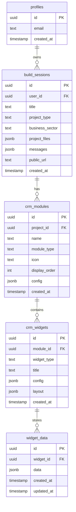
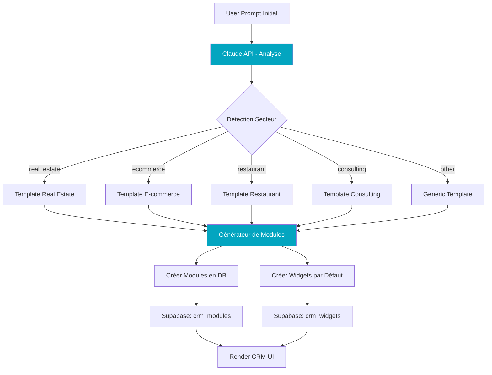
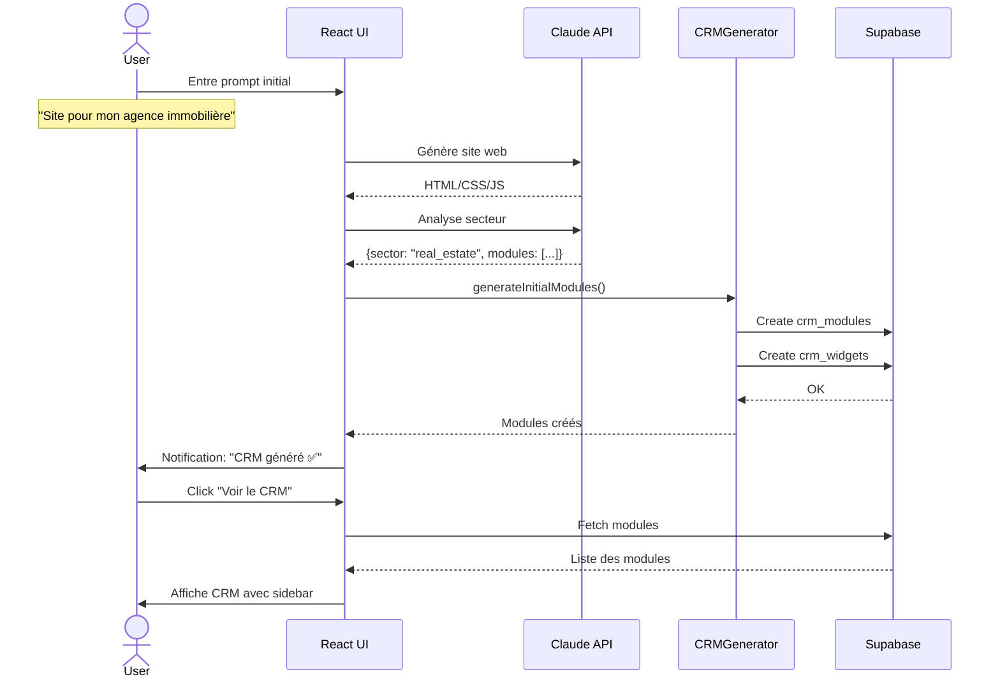
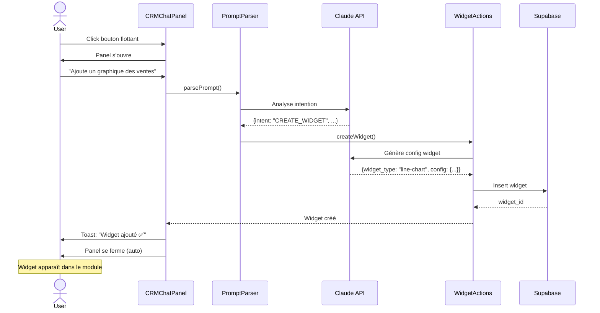

# 🚀 Plan d'Architecture - Magellan CRM/ERP Evolution

**Date**: 23 Décembre 2025
**Version**: 1.0
**Objectif**: Transformer le builder en plateforme intelligente générant automatiquement un CRM/ERP personnalisé par secteur

---

## 📋 Table des Matières

1. [Vision Fonctionnelle](#1-vision-fonctionnelle)
2. [Solutions UX/UI - Barre de Conversation](#2-solutions-uxui---barre-de-conversation)
3. [Architecture de Données Supabase](#3-architecture-de-données-supabase)
4. [Système de Génération Intelligente](#4-système-de-génération-intelligente)
5. [Architecture de Rendu Dynamique](#5-architecture-de-rendu-dynamique)
6. [Prompt Engineering](#6-prompt-engineering)
7. [Roadmap d'Implémentation](#7-roadmap-dimplémentation)
8. [Spécifications Fonctionnelles](#8-spécifications-fonctionnelles)
9. [Recommandations Techniques](#9-recommandations-techniques)

---

## 1. Vision Fonctionnelle

### 1.1 Transformation du Workflow Utilisateur

**AVANT (Actuel)**:
```
User entre prompt → Génère site web → Modules statiques identiques pour tous
```

**APRÈS (Évolution)**:
```
User entre prompt →
  ├── Génère site web (existant)
  └── Génère modules CRM/ERP adaptés au secteur détecté
      ├── Détection automatique du secteur d'activité
      ├── Création de modules métier pertinents
      └── Population de widgets par défaut dans chaque module
```

### 1.2 Génération Initiale Intelligente

**Exemple 1 - Agence Immobilière**:

**Prompt User**:
> "Je veux un site pour mon agence immobilière à Lyon, avec présentation de nos biens et formulaire de contact"

**Génération Automatique**:
```
✅ Site Web (HTML/CSS/JS)
   └── Pages: Accueil, Biens, Contact, À propos

✅ Modules CRM Générés:
   ├── 📦 Gestion de Biens
   │   ├── Widget: Tableau des biens (colonnes: adresse, prix, statut, surface)
   │   ├── Widget: Carte avec localisation des biens
   │   └── Widget: KPI - Nombre de biens actifs
   ├── 📅 Visites
   │   ├── Widget: Calendrier des visites planifiées
   │   ├── Widget: Liste des demandes de visite
   │   └── Widget: KPI - Taux de conversion visite→vente
   ├── 📄 Mandats
   │   ├── Widget: Liste des mandats (exclusifs/simples)
   │   └── Widget: Timeline - Échéances des mandats
   ├── 👥 Acquéreurs
   │   ├── Widget: Base de contacts acquéreurs
   │   ├── Widget: Filtres par critères (budget, localisation)
   │   └── Widget: KPI - Leads actifs
   └── 📊 Statistiques
       ├── Widget: Graphique des ventes mensuelles
       └── Widget: Top biens les plus consultés
```

**Exemple 2 - E-commerce**:

**Prompt User**:
> "Je veux créer une boutique en ligne pour vendre des accessoires de sport"

**Génération Automatique**:
```
✅ Site Web (React + E-commerce)
   └── Pages: Shop, Panier, Checkout, Mon compte

✅ Modules CRM Générés:
   ├── 📦 Produits
   │   ├── Widget: Tableau produits (nom, prix, stock, catégorie)
   │   ├── Widget: Formulaire ajout/édition produit
   │   └── Widget: KPI - Produits en rupture de stock
   ├── 🛒 Commandes
   │   ├── Widget: Liste des commandes (statut, date, montant)
   │   ├── Widget: Détail commande (produits, client, livraison)
   │   └── Widget: KPI - CA du mois
   ├── 📦 Stock
   │   ├── Widget: Niveaux de stock en temps réel
   │   ├── Widget: Alertes rupture de stock
   │   └── Widget: Historique mouvements de stock
   ├── 👥 Clients
   │   ├── Widget: Base clients (nom, email, commandes)
   │   ├── Widget: Segmentation (nouveaux, fidèles, inactifs)
   │   └── Widget: KPI - Lifetime Value moyenne
   └── 📊 Analytics
       ├── Widget: Graphique ventes par catégorie
       └── Widget: Produits les plus vendus
```

### 1.3 Bac à Sable Conversationnel

Une fois les modules initiaux générés, l'utilisateur peut **personnaliser chaque module via prompt**.

**Exemples de Prompts dans un Module**:

```
Module: "Gestion de Biens" (Agence Immobilière)

User: "Ajoute un widget pour tracker les commissions par bien"
→ Système génère un widget "Tableau Commissions" avec colonnes adaptées

User: "Crée un tableau de suivi des leads avec filtres par source"
→ Système génère un widget "Leads" avec filtres dropdown

User: "Ajoute un graphique des ventes mensuelles"
→ Système génère un chart.js avec données mockées + connexion future DB

User: "Supprime le widget de la carte géographique"
→ Système retire le widget du layout
```

**Contrainte Clé**: Respect absolu de la DA Magellan (couleur cyan #03A5C0, glassmorphism, border-radius, etc.)

---

## 2. Solutions UX/UI - Barre de Conversation

### 2.1 Problématique

Dans le **Builder Session** actuel, la barre de conversation (`PromptBar`) est positionnée **en bas** et fonctionne bien car:
- Pas de sidebar de navigation (juste panels Code/Preview)
- Interface épurée
- Focus sur la génération de code

Dans le **CRM View** (Settings avec modules), on a:
- ✅ Sidebar de navigation à gauche (modules)
- ✅ Zone de contenu centrale (widgets du module)
- ❓ **Où placer la barre de conversation sans gêner l'UX ?**

### 2.2 Solution Recommandée: Bouton Flottant + Panel Latéral Droit

**Option C - Retenue** (tel que spécifié par l'utilisateur):

```
┌─────────────────────────────────────────────────────────┐
│  Header (Logo, User, Theme Toggle)                      │
├───────┬─────────────────────────────────────────────────┤
│       │  Module Content (Widgets)                       │
│ Side  │                                                  │
│ bar   │  ┌──────────────┐  ┌──────────────┐            │
│       │  │ Widget 1     │  │ Widget 2     │            │
│ [🏠]  │  │ (Chart)      │  │ (Table)      │            │
│ [📊]  │  └──────────────┘  └──────────────┘            │
│ [📧]  │                                                  │
│ [📝]  │  ┌──────────────────────────────┐              │
│ [💰]  │  │ Widget 3 (KPI Cards)         │              │
│       │  └──────────────────────────────┘              │
│ [⚙️]  │                                         [💬]←── │
│       │                                      Floating   │
└───────┴─────────────────────────────────────────────────┘
                                             Button
                                             (sticky)
```

**Clic sur le bouton flottant 💬** :

```
┌─────────────────────────────────────────────────┬───────────┐
│  Header                                         │           │
├───────┬─────────────────────────────────────────┤  Chat     │
│       │  Module Content (légèrement obscurci)   │  Panel    │
│ Side  │                                          │           │
│ bar   │  ┌──────────────┐  ┌──────────────┐    │ Messages: │
│       │  │ Widget 1     │  │ Widget 2     │    │ ┌───────┐ │
│ [🏠]  │  │ (Chart)      │  │ (Table)      │    │ │User   │ │
│ [📊]  │  └──────────────┘  └──────────────┘    │ │Msg    │ │
│ [📧]  │                                          │ └───────┘ │
│ [📝]  │  ┌──────────────────────────────┐      │ ┌───────┐ │
│ [💰]  │  │ Widget 3 (obscured)          │      │ │AI Msg │ │
│       │  └──────────────────────────────┘      │ └───────┘ │
│ [⚙️]  │                                  [X]←───│           │
│       │                               Close     │ PromptBar │
└───────┴─────────────────────────────────────────┴───────────┘
                                                  (width: 400px)
```

**Caractéristiques**:

✅ **Accessibilité**: Bouton toujours visible (sticky position: bottom-right)
✅ **Non-intrusif**: Ferme automatiquement après envoi du prompt
✅ **Responsive**: Sur mobile, le panel prend toute la largeur
✅ **DA Respectée**: Background avec glassmorphism, border cyan au hover
✅ **Ombre subtile**: Pour créer une séparation visuelle avec les widgets en dessous

**Composant Technique**:
```tsx
// components/CRMChatPanel.tsx
<div className="fixed bottom-6 right-6 z-50">
  {/* Floating Button */}
  <Button
    onClick={() => setIsChatOpen(!isChatOpen)}
    className="w-14 h-14 rounded-full shadow-lg"
    style={{
      backgroundColor: '#03A5C0',
      color: 'white'
    }}
  >
    <MessageSquare className="w-6 h-6" />
  </Button>

  {/* Slide-in Panel */}
  {isChatOpen && (
    <div className="fixed inset-y-0 right-0 w-[400px] bg-card/95 backdrop-blur-lg border-l border-border shadow-2xl">
      {/* Overlay sur le contenu */}
      <div
        className="fixed inset-0 bg-black/10 backdrop-blur-[2px]"
        onClick={() => setIsChatOpen(false)}
      />

      {/* Chat Content */}
      <div className="relative z-10 h-full flex flex-col">
        <ChatMessages />
        <PromptBar
          modificationMode={true}
          placeholder="Modifie ce module..."
        />
      </div>
    </div>
  )}
</div>
```

**Ombre autour du panel** (tel que demandé):
```css
/* Légère ombre de la couleur du background pour créer séparation */
box-shadow:
  -4px 0 20px rgba(0, 0, 0, 0.1),
  -2px 0 10px rgba(3, 165, 192, 0.05);
```

---

## 3. Architecture de Données Supabase

### 3.1 Schéma Étendu - Vue d'Ensemble



### 3.2 Tables Détaillées

#### 3.2.1 Extension de `build_sessions`

```sql
ALTER TABLE public.build_sessions
  -- Nouveau champ pour le secteur détecté
  ADD COLUMN business_sector TEXT,

  -- Nouveau champ pour la config initiale des modules
  ADD COLUMN initial_modules_config JSONB DEFAULT '[]'::jsonb;

COMMENT ON COLUMN build_sessions.business_sector IS
  'Secteur d''activité détecté par l''IA: real_estate, ecommerce, restaurant, consulting, etc.';

COMMENT ON COLUMN build_sessions.initial_modules_config IS
  'Configuration des modules générés initialement par l''IA';
```

#### 3.2.2 Table `crm_modules` (Nouveauté)

```sql
CREATE TABLE public.crm_modules (
  id UUID PRIMARY KEY DEFAULT gen_random_uuid(),
  project_id UUID REFERENCES build_sessions(id) ON DELETE CASCADE NOT NULL,

  -- Identité du module
  name TEXT NOT NULL,
  -- Ex: "Gestion de Biens", "Produits", "Commandes"

  module_type TEXT NOT NULL,
  -- Ex: "inventory", "sales", "clients", "analytics"

  icon TEXT NOT NULL,
  -- Lucide icon name: "Package", "ShoppingCart", "Users", etc.

  display_order INT NOT NULL DEFAULT 0,
  -- Ordre d'affichage dans la sidebar

  -- Configuration JSON
  config JSONB DEFAULT '{}'::jsonb,
  -- Ex: { "color": "#03A5C0", "description": "Gérez vos biens immobiliers" }

  is_active BOOLEAN DEFAULT true,

  created_at TIMESTAMP WITH TIME ZONE DEFAULT now(),
  updated_at TIMESTAMP WITH TIME ZONE DEFAULT now()
);

CREATE INDEX idx_crm_modules_project ON crm_modules(project_id);
CREATE INDEX idx_crm_modules_order ON crm_modules(project_id, display_order);

ALTER TABLE crm_modules ENABLE ROW LEVEL SECURITY;

CREATE POLICY "Users can view own modules"
  ON crm_modules FOR SELECT
  USING (
    EXISTS (
      SELECT 1 FROM build_sessions
      WHERE build_sessions.id = crm_modules.project_id
      AND build_sessions.user_id = auth.uid()
    )
  );

CREATE POLICY "Users can manage own modules"
  ON crm_modules FOR ALL
  USING (
    EXISTS (
      SELECT 1 FROM build_sessions
      WHERE build_sessions.id = crm_modules.project_id
      AND build_sessions.user_id = auth.uid()
    )
  );
```

#### 3.2.3 Table `crm_widgets` (Nouveauté)

```sql
CREATE TABLE public.crm_widgets (
  id UUID PRIMARY KEY DEFAULT gen_random_uuid(),
  module_id UUID REFERENCES crm_modules(id) ON DELETE CASCADE NOT NULL,

  -- Type de widget (depuis la registry)
  widget_type TEXT NOT NULL,
  -- Ex: "data-table", "kpi-card", "line-chart", "form", "calendar"

  title TEXT NOT NULL,
  -- Ex: "Liste des biens", "CA du mois", "Graphique des ventes"

  -- Configuration spécifique au type de widget
  config JSONB NOT NULL DEFAULT '{}'::jsonb,
  -- Ex pour data-table:
  -- {
  --   "columns": [
  --     {"key": "address", "label": "Adresse", "type": "text"},
  --     {"key": "price", "label": "Prix", "type": "currency"},
  --     {"key": "status", "label": "Statut", "type": "badge"}
  --   ],
  --   "filters": ["status", "price_range"],
  --   "sortable": true
  -- }

  -- Layout dans le module (grid system)
  layout JSONB NOT NULL DEFAULT '{}'::jsonb,
  -- Ex: {"x": 0, "y": 0, "w": 6, "h": 4} (grid 12 colonnes)

  display_order INT DEFAULT 0,
  is_visible BOOLEAN DEFAULT true,

  created_at TIMESTAMP WITH TIME ZONE DEFAULT now(),
  updated_at TIMESTAMP WITH TIME ZONE DEFAULT now()
);

CREATE INDEX idx_crm_widgets_module ON crm_widgets(module_id);
CREATE INDEX idx_crm_widgets_type ON crm_widgets(widget_type);

ALTER TABLE crm_widgets ENABLE ROW LEVEL SECURITY;

CREATE POLICY "Users can view own widgets"
  ON crm_widgets FOR SELECT
  USING (
    EXISTS (
      SELECT 1 FROM crm_modules m
      JOIN build_sessions b ON b.id = m.project_id
      WHERE m.id = crm_widgets.module_id
      AND b.user_id = auth.uid()
    )
  );

CREATE POLICY "Users can manage own widgets"
  ON crm_widgets FOR ALL
  USING (
    EXISTS (
      SELECT 1 FROM crm_modules m
      JOIN build_sessions b ON b.id = m.project_id
      WHERE m.id = crm_widgets.module_id
      AND b.user_id = auth.uid()
    )
  );
```

#### 3.2.4 Table `widget_data` (Nouveauté)

```sql
CREATE TABLE public.widget_data (
  id UUID PRIMARY KEY DEFAULT gen_random_uuid(),
  widget_id UUID REFERENCES crm_widgets(id) ON DELETE CASCADE NOT NULL,

  -- Données du widget (flexible)
  data JSONB NOT NULL DEFAULT '{}'::jsonb,
  -- Ex pour un tableau:
  -- {
  --   "rows": [
  --     {"id": "1", "address": "123 rue Paris", "price": 350000, "status": "available"},
  --     {"id": "2", "address": "456 av Lyon", "price": 450000, "status": "sold"}
  --   ]
  -- }
  -- Ex pour un KPI:
  -- {"value": 24, "trend": "+12%", "period": "month"}

  -- Métadonnées
  metadata JSONB DEFAULT '{}'::jsonb,

  created_at TIMESTAMP WITH TIME ZONE DEFAULT now(),
  updated_at TIMESTAMP WITH TIME ZONE DEFAULT now()
);

CREATE INDEX idx_widget_data_widget ON widget_data(widget_id);
CREATE INDEX idx_widget_data_updated ON widget_data(updated_at DESC);

ALTER TABLE widget_data ENABLE ROW LEVEL SECURITY;

CREATE POLICY "Users can view own widget data"
  ON widget_data FOR SELECT
  USING (
    EXISTS (
      SELECT 1 FROM crm_widgets w
      JOIN crm_modules m ON m.id = w.module_id
      JOIN build_sessions b ON b.id = m.project_id
      WHERE w.id = widget_data.widget_id
      AND b.user_id = auth.uid()
    )
  );

CREATE POLICY "Users can manage own widget data"
  ON widget_data FOR ALL
  USING (
    EXISTS (
      SELECT 1 FROM crm_widgets w
      JOIN crm_modules m ON m.id = w.module_id
      JOIN build_sessions b ON b.id = m.project_id
      WHERE w.id = widget_data.widget_id
      AND b.user_id = auth.uid()
    )
  );
```

### 3.3 Exemple de Données - Agence Immobilière

```sql
-- 1. Build Session
INSERT INTO build_sessions (id, user_id, title, business_sector, project_type)
VALUES (
  'proj-123',
  'user-456',
  'Agence Immobilière Lyon',
  'real_estate',
  'website'
);

-- 2. Modules CRM
INSERT INTO crm_modules (id, project_id, name, module_type, icon, display_order) VALUES
  ('mod-1', 'proj-123', 'Gestion de Biens', 'inventory', 'Building2', 1),
  ('mod-2', 'proj-123', 'Visites', 'appointments', 'Calendar', 2),
  ('mod-3', 'proj-123', 'Mandats', 'contracts', 'FileText', 3),
  ('mod-4', 'proj-123', 'Acquéreurs', 'clients', 'Users', 4);

-- 3. Widgets pour "Gestion de Biens"
INSERT INTO crm_widgets (module_id, widget_type, title, config, layout) VALUES
  (
    'mod-1',
    'data-table',
    'Liste des Biens',
    '{
      "columns": [
        {"key": "address", "label": "Adresse", "type": "text"},
        {"key": "price", "label": "Prix", "type": "currency"},
        {"key": "surface", "label": "Surface", "type": "number", "unit": "m²"},
        {"key": "status", "label": "Statut", "type": "badge"}
      ],
      "actions": ["edit", "view", "delete"],
      "pagination": true
    }',
    '{"x": 0, "y": 0, "w": 12, "h": 6}'
  ),
  (
    'mod-1',
    'kpi-card',
    'Biens Actifs',
    '{
      "valueKey": "count",
      "trendKey": "trend",
      "icon": "Home",
      "color": "#03A5C0"
    }',
    '{"x": 0, "y": 6, "w": 4, "h": 2}'
  );

-- 4. Données du widget "Biens Actifs"
INSERT INTO widget_data (widget_id, data) VALUES
  (
    'widget-kpi-1',
    '{
      "count": 24,
      "trend": "+3 ce mois",
      "period": "month"
    }'
  );
```

---

## 4. Système de Génération Intelligente

### 4.1 Architecture du Système



### 4.2 Prompt Engineering - Détection de Secteur

**System Prompt** (à envoyer à Claude API):

```typescript
const SECTOR_DETECTION_PROMPT = `
Tu es un assistant spécialisé dans l'analyse de prompts pour générer des CRM/ERP personnalisés.

Ta tâche: analyser le prompt de l'utilisateur et extraire:
1. Le secteur d'activité (business_sector)
2. Les modules CRM pertinents
3. Les widgets de base pour chaque module

Réponds UNIQUEMENT en JSON valide avec cette structure:

{
  "business_sector": "real_estate" | "ecommerce" | "restaurant" | "consulting" | "construction" | "health" | "education" | "other",
  "sector_confidence": 0.0-1.0,
  "business_description": "Description courte du métier",
  "suggested_modules": [
    {
      "name": "Nom du module",
      "module_type": "inventory" | "sales" | "clients" | "analytics" | "appointments" | "contracts",
      "icon": "Lucide icon name",
      "priority": 1-10,
      "widgets": [
        {
          "widget_type": "data-table" | "kpi-card" | "line-chart" | "form" | "calendar",
          "title": "Titre du widget",
          "config": {...}
        }
      ]
    }
  ]
}

Exemples de secteurs:
- real_estate: agence immobilière, gestion locative
- ecommerce: boutique en ligne, vente de produits
- restaurant: restaurant, café, traiteur
- consulting: cabinet de conseil, coaching
- construction: entreprise BTP, artisan
- health: cabinet médical, physiothérapie
- education: centre de formation, école

Utilisateur: "${userPrompt}"
`;
```

**Exemple de Réponse Claude**:

```json
{
  "business_sector": "real_estate",
  "sector_confidence": 0.95,
  "business_description": "Agence immobilière spécialisée dans la vente et location de biens",
  "suggested_modules": [
    {
      "name": "Gestion de Biens",
      "module_type": "inventory",
      "icon": "Building2",
      "priority": 10,
      "widgets": [
        {
          "widget_type": "data-table",
          "title": "Liste des Biens",
          "config": {
            "columns": [
              {"key": "address", "label": "Adresse", "type": "text"},
              {"key": "price", "label": "Prix", "type": "currency"},
              {"key": "surface", "label": "Surface", "type": "number", "unit": "m²"},
              {"key": "status", "label": "Statut", "type": "badge", "values": ["Disponible", "Vendu", "Loué"]}
            ]
          }
        },
        {
          "widget_type": "kpi-card",
          "title": "Biens Actifs",
          "config": {
            "icon": "Home",
            "color": "#03A5C0"
          }
        }
      ]
    },
    {
      "name": "Visites",
      "module_type": "appointments",
      "icon": "Calendar",
      "priority": 9,
      "widgets": [
        {
          "widget_type": "calendar",
          "title": "Calendrier des Visites",
          "config": {
            "view": "week",
            "editable": true
          }
        }
      ]
    }
  ]
}
```

### 4.3 Service de Génération (TypeScript)

```typescript
// src/services/crmGenerator.ts

import { supabase } from '@/integrations/supabase/client';

interface ModuleSpec {
  name: string;
  module_type: string;
  icon: string;
  priority: number;
  widgets: WidgetSpec[];
}

interface WidgetSpec {
  widget_type: string;
  title: string;
  config: any;
}

export class CRMGeneratorService {
  /**
   * Génère les modules CRM initiaux pour un projet
   */
  async generateInitialModules(
    projectId: string,
    userPrompt: string
  ): Promise<void> {
    // 1. Appel Claude API pour détecter le secteur
    const sectorAnalysis = await this.analyzeSector(userPrompt);

    // 2. Mise à jour du projet avec le secteur détecté
    await supabase
      .from('build_sessions')
      .update({
        business_sector: sectorAnalysis.business_sector,
        initial_modules_config: sectorAnalysis.suggested_modules
      })
      .eq('id', projectId);

    // 3. Création des modules en DB
    for (const moduleSpec of sectorAnalysis.suggested_modules) {
      const moduleId = await this.createModule(projectId, moduleSpec);

      // 4. Création des widgets pour chaque module
      await this.createWidgets(moduleId, moduleSpec.widgets);
    }
  }

  private async analyzeSector(prompt: string) {
    const response = await fetch('/api/analyze-sector', {
      method: 'POST',
      body: JSON.stringify({ prompt }),
      headers: { 'Content-Type': 'application/json' }
    });

    return response.json();
  }

  private async createModule(
    projectId: string,
    spec: ModuleSpec
  ): Promise<string> {
    const { data, error } = await supabase
      .from('crm_modules')
      .insert({
        project_id: projectId,
        name: spec.name,
        module_type: spec.module_type,
        icon: spec.icon,
        display_order: spec.priority
      })
      .select()
      .single();

    if (error) throw error;
    return data.id;
  }

  private async createWidgets(
    moduleId: string,
    widgets: WidgetSpec[]
  ): Promise<void> {
    const widgetsToInsert = widgets.map((widget, index) => ({
      module_id: moduleId,
      widget_type: widget.widget_type,
      title: widget.title,
      config: widget.config,
      layout: this.calculateLayout(index, widgets.length),
      display_order: index
    }));

    const { error } = await supabase
      .from('crm_widgets')
      .insert(widgetsToInsert);

    if (error) throw error;
  }

  private calculateLayout(index: number, total: number) {
    // Simple grid layout: 2 colonnes
    const col = index % 2;
    const row = Math.floor(index / 2);

    return {
      x: col * 6,  // Grid 12 colonnes
      y: row * 4,
      w: 6,
      h: 4
    };
  }
}
```

---

## 5. Architecture de Rendu Dynamique

### 5.1 Registry de Widgets

```typescript
// src/components/crm/widgets/WidgetRegistry.tsx

import { DataTable } from './DataTable';
import { KPICard } from './KPICard';
import { LineChart } from './LineChart';
import { FormWidget } from './FormWidget';
import { CalendarWidget } from './CalendarWidget';
import { MapWidget } from './MapWidget';

export type WidgetType =
  | 'data-table'
  | 'kpi-card'
  | 'line-chart'
  | 'bar-chart'
  | 'pie-chart'
  | 'form'
  | 'calendar'
  | 'map'
  | 'kanban';

export const WIDGET_REGISTRY: Record<
  WidgetType,
  React.ComponentType<WidgetProps>
> = {
  'data-table': DataTable,
  'kpi-card': KPICard,
  'line-chart': LineChart,
  'bar-chart': LineChart, // Même composant, config différente
  'pie-chart': LineChart,
  'form': FormWidget,
  'calendar': CalendarWidget,
  'map': MapWidget,
  'kanban': KanbanBoard
};

export interface WidgetProps {
  widgetId: string;
  title: string;
  config: any;
  data?: any;
  onUpdate?: (newData: any) => void;
}
```

### 5.2 Composant Module Viewer

```typescript
// src/components/crm/ModuleViewer.tsx

import { useEffect, useState } from 'react';
import { supabase } from '@/integrations/supabase/client';
import { WIDGET_REGISTRY } from './widgets/WidgetRegistry';
import { GridLayout } from 'react-grid-layout';

interface Widget {
  id: string;
  widget_type: string;
  title: string;
  config: any;
  layout: {x: number; y: number; w: number; h: number};
}

export function ModuleViewer({ moduleId }: { moduleId: string }) {
  const [widgets, setWidgets] = useState<Widget[]>([]);
  const [loading, setLoading] = useState(true);

  useEffect(() => {
    fetchWidgets();
  }, [moduleId]);

  const fetchWidgets = async () => {
    const { data, error } = await supabase
      .from('crm_widgets')
      .select('*')
      .eq('module_id', moduleId)
      .eq('is_visible', true)
      .order('display_order');

    if (!error) setWidgets(data);
    setLoading(false);
  };

  if (loading) return <div>Chargement...</div>;

  return (
    <div className="p-6 space-y-4">
      <GridLayout
        className="grid grid-cols-12 gap-4"
        cols={12}
        rowHeight={80}
        width={1200}
      >
        {widgets.map((widget) => {
          const WidgetComponent = WIDGET_REGISTRY[widget.widget_type];

          if (!WidgetComponent) {
            console.warn(`Widget type "${widget.widget_type}" not found`);
            return null;
          }

          return (
            <div
              key={widget.id}
              data-grid={widget.layout}
              className="bg-card/80 backdrop-blur-sm border border-border/50 rounded-xl p-4 shadow-sm"
            >
              <WidgetComponent
                widgetId={widget.id}
                title={widget.title}
                config={widget.config}
              />
            </div>
          );
        })}
      </GridLayout>
    </div>
  );
}
```

### 5.3 Exemple de Widget - Data Table

```typescript
// src/components/crm/widgets/DataTable.tsx

import { useState, useEffect } from 'react';
import { supabase } from '@/integrations/supabase/client';
import {
  Table,
  TableBody,
  TableCell,
  TableHead,
  TableHeader,
  TableRow,
} from '@/components/ui/table';
import { Badge } from '@/components/ui/badge';
import type { WidgetProps } from './WidgetRegistry';

export function DataTable({ widgetId, title, config }: WidgetProps) {
  const [data, setData] = useState<any[]>([]);

  useEffect(() => {
    fetchData();
  }, [widgetId]);

  const fetchData = async () => {
    const { data: widgetData } = await supabase
      .from('widget_data')
      .select('data')
      .eq('widget_id', widgetId)
      .single();

    if (widgetData?.data?.rows) {
      setData(widgetData.data.rows);
    }
  };

  const renderCell = (row: any, column: any) => {
    const value = row[column.key];

    switch (column.type) {
      case 'currency':
        return new Intl.NumberFormat('fr-FR', {
          style: 'currency',
          currency: 'EUR'
        }).format(value);

      case 'badge':
        return (
          <Badge
            variant={value === 'Disponible' ? 'default' : 'secondary'}
            style={{
              backgroundColor: value === 'Disponible' ? '#03A5C0' : undefined
            }}
          >
            {value}
          </Badge>
        );

      case 'number':
        return `${value} ${column.unit || ''}`;

      default:
        return value;
    }
  };

  return (
    <div className="space-y-4">
      <h3 className="text-lg font-semibold text-foreground">{title}</h3>

      <div className="border border-border/50 rounded-lg overflow-hidden">
        <Table>
          <TableHeader>
            <TableRow>
              {config.columns.map((col: any) => (
                <TableHead key={col.key}>{col.label}</TableHead>
              ))}
            </TableRow>
          </TableHeader>
          <TableBody>
            {data.map((row, i) => (
              <TableRow key={i}>
                {config.columns.map((col: any) => (
                  <TableCell key={col.key}>
                    {renderCell(row, col)}
                  </TableCell>
                ))}
              </TableRow>
            ))}
          </TableBody>
        </Table>
      </div>
    </div>
  );
}
```

### 5.4 Exemple de Widget - KPI Card

```typescript
// src/components/crm/widgets/KPICard.tsx

import { useState, useEffect } from 'react';
import { supabase } from '@/integrations/supabase/client';
import { TrendingUp, TrendingDown } from 'lucide-react';
import * as Icons from 'lucide-react';
import type { WidgetProps } from './WidgetRegistry';

export function KPICard({ widgetId, title, config }: WidgetProps) {
  const [data, setData] = useState<any>(null);

  useEffect(() => {
    fetchData();
  }, [widgetId]);

  const fetchData = async () => {
    const { data: widgetData } = await supabase
      .from('widget_data')
      .select('data')
      .eq('widget_id', widgetId)
      .single();

    if (widgetData) setData(widgetData.data);
  };

  if (!data) return <div>Chargement...</div>;

  const Icon = Icons[config.icon as keyof typeof Icons] || Icons.BarChart3;
  const isPositiveTrend = data.trend?.startsWith('+');

  return (
    <div className="flex items-center justify-between h-full">
      <div className="space-y-1">
        <p className="text-sm text-muted-foreground">{title}</p>
        <p className="text-3xl font-bold text-foreground">{data.value}</p>
        <div className="flex items-center gap-1 text-sm">
          {isPositiveTrend ? (
            <TrendingUp className="w-4 h-4 text-green-500" />
          ) : (
            <TrendingDown className="w-4 h-4 text-red-500" />
          )}
          <span className={isPositiveTrend ? 'text-green-500' : 'text-red-500'}>
            {data.trend}
          </span>
        </div>
      </div>

      <div
        className="w-12 h-12 rounded-full flex items-center justify-center"
        style={{
          backgroundColor: `${config.color}15`,
          color: config.color
        }}
      >
        <Icon className="w-6 h-6" />
      </div>
    </div>
  );
}
```

---

## 6. Prompt Engineering

### 6.1 Système de Parsing des Prompts CRM

```typescript
// src/services/crmPromptParser.ts

export class CRMPromptParser {
  /**
   * Analyse un prompt utilisateur dans le contexte d'un module CRM
   * Retourne l'intention et les paramètres
   */
  async parsePrompt(prompt: string, moduleId: string) {
    const systemPrompt = `
Tu es un assistant pour un système CRM. L'utilisateur va te donner une instruction
pour modifier le module CRM actuel.

Détecte l'intention parmi:
- CREATE_WIDGET: créer un nouveau widget
- UPDATE_WIDGET: modifier un widget existant
- DELETE_WIDGET: supprimer un widget
- UPDATE_DATA: mettre à jour les données d'un widget

Réponds en JSON:
{
  "intent": "CREATE_WIDGET" | "UPDATE_WIDGET" | "DELETE_WIDGET" | "UPDATE_DATA",
  "confidence": 0.0-1.0,
  "params": {
    // Paramètres spécifiques à l'intention
  }
}

Pour CREATE_WIDGET, params doit contenir:
{
  "widget_type": "data-table" | "kpi-card" | "line-chart" | etc.,
  "title": "Titre du widget",
  "config": {...}  // Configuration selon le type
}

Utilisateur: "${prompt}"
    `;

    // Appel à Claude API
    const response = await this.callClaude(systemPrompt);
    return JSON.parse(response);
  }

  private async callClaude(prompt: string) {
    // Implémentation appel API
    const response = await fetch('/api/claude', {
      method: 'POST',
      body: JSON.stringify({ prompt }),
      headers: { 'Content-Type': 'application/json' }
    });

    const data = await response.json();
    return data.content;
  }
}
```

### 6.2 Exemples de Prompts et Réponses

**Prompt User**: "Ajoute un widget pour tracker les commissions par bien"

**Réponse Claude**:
```json
{
  "intent": "CREATE_WIDGET",
  "confidence": 0.98,
  "params": {
    "widget_type": "data-table",
    "title": "Commissions par Bien",
    "config": {
      "columns": [
        {"key": "property_address", "label": "Bien", "type": "text"},
        {"key": "sale_price", "label": "Prix de Vente", "type": "currency"},
        {"key": "commission_rate", "label": "Taux", "type": "percent"},
        {"key": "commission_amount", "label": "Commission", "type": "currency"},
        {"key": "date", "label": "Date", "type": "date"}
      ],
      "sortable": true,
      "pagination": true
    }
  }
}
```

**Prompt User**: "Crée un graphique des ventes mensuelles"

**Réponse Claude**:
```json
{
  "intent": "CREATE_WIDGET",
  "confidence": 0.95,
  "params": {
    "widget_type": "line-chart",
    "title": "Ventes Mensuelles",
    "config": {
      "xAxis": {"key": "month", "label": "Mois"},
      "yAxis": {"key": "revenue", "label": "Chiffre d'Affaires", "format": "currency"},
      "color": "#03A5C0",
      "smooth": true,
      "showGrid": true
    }
  }
}
```

**Prompt User**: "Supprime le widget de la carte géographique"

**Réponse Claude**:
```json
{
  "intent": "DELETE_WIDGET",
  "confidence": 0.92,
  "params": {
    "target": "map widget",
    "widget_type": "map"
  }
}
```

---

## 7. Roadmap d'Implémentation

### Phase 1: Infrastructure de Base (Semaines 1-2)

**Objectif**: Mettre en place les fondations techniques

**Tâches**:

✅ **Database Schema**
- [ ] Créer migrations Supabase pour `crm_modules`, `crm_widgets`, `widget_data`
- [ ] Étendre `build_sessions` avec `business_sector`
- [ ] Tester les RLS policies
- [ ] Créer des indexes pour performance

📁 **Fichiers à créer**:
- `supabase/migrations/20250124_crm_modules.sql`
- `supabase/migrations/20250124_crm_widgets.sql`
- `supabase/migrations/20250124_widget_data.sql`

✅ **Service de Détection de Secteur**
- [ ] Créer Edge Function Supabase `/api/analyze-sector`
- [ ] Implémenter le prompt engineering pour détection
- [ ] Tester avec différents secteurs
- [ ] Créer des templates par secteur (real_estate, ecommerce, etc.)

📁 **Fichiers à créer**:
- `supabase/functions/analyze-sector/index.ts`
- `src/services/crmGenerator.ts`
- `src/constants/sectorTemplates.ts`

✅ **Tests**
- [ ] Tester la détection avec 10 prompts variés
- [ ] Vérifier que les modules sont créés en DB
- [ ] Valider la structure JSON retournée

**Critère de Succès**:
- Pouvoir détecter automatiquement le secteur à partir d'un prompt
- Schéma DB opérationnel avec données de test

---

### Phase 2: Système de Widgets (Semaines 3-4)

**Objectif**: Créer la registry de widgets et le rendu dynamique

**Tâches**:

✅ **Registry de Widgets**
- [ ] Créer `WidgetRegistry.tsx`
- [ ] Implémenter les widgets de base:
  - `DataTable.tsx`
  - `KPICard.tsx`
  - `LineChart.tsx` (avec recharts)
  - `FormWidget.tsx`
  - `CalendarWidget.tsx`

📁 **Fichiers à créer**:
- `src/components/crm/widgets/WidgetRegistry.tsx`
- `src/components/crm/widgets/DataTable.tsx`
- `src/components/crm/widgets/KPICard.tsx`
- `src/components/crm/widgets/LineChart.tsx`
- `src/components/crm/widgets/FormWidget.tsx`
- `src/components/crm/widgets/CalendarWidget.tsx`

✅ **Module Viewer**
- [ ] Créer `ModuleViewer.tsx` avec react-grid-layout
- [ ] Fetch des widgets depuis Supabase
- [ ] Rendu dynamique selon widget_type
- [ ] Gestion du layout (grid 12 colonnes)

📁 **Fichiers à créer**:
- `src/components/crm/ModuleViewer.tsx`
- `src/hooks/useModuleWidgets.ts`

✅ **Respect de la DA**
- [ ] Tous les widgets utilisent les couleurs Magellan (#03A5C0)
- [ ] Cards avec glassmorphism (`bg-card/80 backdrop-blur-sm`)
- [ ] Border radius cohérent (`rounded-xl`)
- [ ] Shadows adaptées

**Critère de Succès**:
- Pouvoir afficher un module avec 3-4 widgets différents
- Widgets responsive et cohérents visuellement
- Grid layout fonctionnel

---

### Phase 3: UX Conversationnelle (Semaines 5-6)

**Objectif**: Intégrer la barre de chat dans le CRM

**Tâches**:

✅ **Bouton Flottant + Panel**
- [ ] Créer `CRMChatPanel.tsx` (bouton flottant sticky)
- [ ] Slide-in panel depuis la droite (400px)
- [ ] Overlay léger sur le contenu
- [ ] Animation smooth (transition-smooth)
- [ ] Fermeture auto après envoi

📁 **Fichiers à créer**:
- `src/components/crm/CRMChatPanel.tsx`
- `src/components/crm/CRMPromptBar.tsx`

✅ **Parser de Prompts**
- [ ] Créer `CRMPromptParser.ts`
- [ ] Edge Function `/api/parse-crm-prompt`
- [ ] Détection d'intention (CREATE/UPDATE/DELETE widget)
- [ ] Extraction des paramètres

📁 **Fichiers à créer**:
- `supabase/functions/parse-crm-prompt/index.ts`
- `src/services/crmPromptParser.ts`

✅ **Actions sur les Widgets**
- [ ] Hook `useWidgetActions` (create, update, delete)
- [ ] Feedback temps réel (toast notifications)
- [ ] Historique des actions (undo/redo?)

📁 **Fichiers à créer**:
- `src/hooks/useWidgetActions.ts`

**Critère de Succès**:
- Chat panel s'ouvre/ferme smoothly
- Pouvoir créer un widget via prompt
- Feedback visuel immédiat

---

### Phase 4: Intégration Complète (Semaine 7)

**Objectif**: Connecter génération initiale + CRM view

**Tâches**:

✅ **Modification du BuilderSession**
- [ ] Après génération du site, déclencher `generateInitialModules()`
- [ ] Afficher notification "CRM généré automatiquement"
- [ ] Ajouter bouton "Voir le CRM" dans le builder

📁 **Fichiers à modifier**:
- `src/pages/BuilderSession.tsx`
- `src/hooks/useGenerateSite.ts`

✅ **Nouvelle Route CRM**
- [ ] Créer page `/project/:id/crm`
- [ ] Sidebar avec modules dynamiques
- [ ] Sélection de module → Render ModuleViewer
- [ ] Intégration du CRMChatPanel

📁 **Fichiers à créer**:
- `src/pages/ProjectCRM.tsx`
- `src/components/crm/CRMSidebar.tsx`
- `src/components/crm/CRMLayout.tsx`

✅ **Extension du SettingsSidebar**
- [ ] Fetch des `crm_modules` depuis DB
- [ ] Afficher modules dynamiques (après les statiques)
- [ ] Icônes dynamiques (lucide-react)
- [ ] Bouton "+ Ajouter un module" (prompt pour créer nouveau module)

📁 **Fichiers à modifier**:
- `src/components/settings/SettingsSidebar.tsx`
- `src/components/settings/SettingsCenter.tsx`

**Critère de Succès**:
- Flow complet: prompt initial → site + CRM généré
- Navigation fluide entre modules
- Modules personnalisés par secteur visibles

---

### Phase 5: Polish & Optimisation (Semaine 8)

**Objectif**: Finitions, performance, UX

**Tâches**:

✅ **Performance**
- [ ] Lazy loading des widgets
- [ ] Virtualisation pour grandes tables (react-virtual)
- [ ] Debounce sur les inputs
- [ ] Cache Supabase queries (React Query)

✅ **UX Polish**
- [ ] Animations cohérentes (framer-motion?)
- [ ] Empty states pour modules sans widgets
- [ ] Loading skeletons
- [ ] Error boundaries

✅ **Responsive**
- [ ] Mobile: sidebar collapsible
- [ ] Mobile: chat panel fullscreen
- [ ] Tablet: grid layout adapté

✅ **Accessibilité**
- [ ] Keyboard navigation
- [ ] ARIA labels
- [ ] Focus management

✅ **Documentation**
- [ ] Guide utilisateur (comment ajouter un widget)
- [ ] Documentation technique (ajouter un nouveau widget type)
- [ ] Exemples de prompts efficaces

**Critère de Succès**:
- Application fluide (60fps)
- Responsive sur mobile/tablet
- Pas d'erreurs console

---

## 8. Spécifications Fonctionnelles

### 8.1 User Stories Principales

**US-1: Génération Automatique du CRM**
```
En tant qu'utilisateur,
Quand je crée un nouveau projet avec un prompt initial,
Alors le système génère automatiquement un CRM adapté à mon secteur d'activité,
Avec des modules et widgets pertinents.
```

**Critères d'Acceptation**:
- [ ] Le secteur est détecté avec confiance > 80%
- [ ] Au moins 3 modules CRM sont créés
- [ ] Chaque module contient 2-4 widgets par défaut
- [ ] Les widgets affichent des données mockées cohérentes

---

**US-2: Navigation entre Modules**
```
En tant qu'utilisateur,
Quand je clique sur un module dans la sidebar,
Alors je vois le contenu du module avec tous ses widgets,
Organisés dans un layout grid.
```

**Critères d'Acceptation**:
- [ ] Transition smooth entre modules (< 300ms)
- [ ] Widgets rendus selon leur type
- [ ] Layout responsive
- [ ] Pas de flash de contenu non stylisé

---

**US-3: Ajout de Widget via Prompt**
```
En tant qu'utilisateur,
Quand je clique sur le bouton chat flottant et entre un prompt,
Alors un nouveau widget est créé dans le module actuel,
Selon ma demande.
```

**Critères d'Acceptation**:
- [ ] Panel s'ouvre en < 200ms
- [ ] Prompt parsé correctement (confiance > 85%)
- [ ] Widget créé en DB
- [ ] Widget affiché immédiatement
- [ ] Notification de succès

---

**US-4: Édition de Widget**
```
En tant qu'utilisateur,
Quand je demande via prompt de modifier un widget existant,
Alors le widget est mis à jour selon ma demande.
```

**Critères d'Acceptation**:
- [ ] Système identifie le bon widget (par titre ou type)
- [ ] Modifications appliquées en DB
- [ ] Re-render du widget
- [ ] Possibilité d'annuler (undo)

---

**US-5: Suppression de Widget**
```
En tant qu'utilisateur,
Quand je demande de supprimer un widget,
Alors le widget disparaît immédiatement,
Avec confirmation préalable si données importantes.
```

**Critères d'Acceptation**:
- [ ] Modal de confirmation si widget contient données
- [ ] Suppression en DB
- [ ] Retrait du layout
- [ ] Animation de sortie smooth

---

### 8.2 Flows Utilisateurs

**Flow 1: Premier Projet avec CRM**



**Flow 2: Personnalisation d'un Module**



---

## 9. Recommandations Techniques

### 9.1 Choix d'Architecture

#### ✅ Approche Recommandée: **Hybrid (DB + Generated Code)**

**Principe**:
- Widgets simples (data-table, kpi-card) → Rendu dynamique depuis config JSON en DB
- Widgets complexes (avec logique métier) → Génération de code React par Claude

**Avantages**:
- ✅ Flexibilité maximale
- ✅ Performance optimale
- ✅ Maintenabilité Lovable (code généré reste éditable)
- ✅ Extensibilité facile (ajouter des widget types)

**Inconvénients**:
- ⚠️ Complexité légèrement supérieure
- ⚠️ Deux systèmes à maintenir

**Implémentation**:
```typescript
// Dans WidgetRegistry
export const renderWidget = (widget: Widget) => {
  if (widget.is_code_generated) {
    // Widget généré par Claude (code React stocké en DB)
    return <DynamicComponent code={widget.generated_code} />;
  } else {
    // Widget from registry
    const Component = WIDGET_REGISTRY[widget.widget_type];
    return <Component {...widget} />;
  }
};
```

---

### 9.2 Patterns Lovable-Friendly

**Pattern 1: Composants Simples et Modulaires**

❌ **À Éviter**:
```tsx
// Composant trop complexe, difficile à éditer dans Lovable
export function MegaWidget({ ...50 props }) {
  // 500 lignes de code
  // Logique complexe imbriquée
  // Multiples useEffect interdépendants
}
```

✅ **À Privilégier**:
```tsx
// Composants atomiques
export function DataTable({ data, columns }: DataTableProps) {
  return (
    <Table>
      <TableHeader columns={columns} />
      <TableBody data={data} columns={columns} />
    </Table>
  );
}

// Logique externalisée
export function useTableData(widgetId: string) {
  const [data, setData] = useState([]);

  useEffect(() => {
    fetchData(widgetId).then(setData);
  }, [widgetId]);

  return data;
}
```

---

**Pattern 2: Props Drilling Minimal**

❌ **À Éviter**:
```tsx
<ModuleViewer>
  <Widget theme={theme} user={user} config={config}>
    <NestedComponent theme={theme} user={user} />
  </Widget>
</ModuleViewer>
```

✅ **À Privilégier**:
```tsx
// Utiliser Zustand pour état global
const useAppStore = create((set) => ({
  theme: 'dark',
  user: null,
  setTheme: (theme) => set({ theme })
}));

// Composants consomment directement
function Widget() {
  const theme = useAppStore(state => state.theme);
  // ...
}
```

---

**Pattern 3: Conventions de Nommage Claires**

✅ **Recommandations**:
- Fichiers composants: PascalCase (`DataTable.tsx`)
- Hooks: camelCase avec préfixe `use` (`useWidgetData.ts`)
- Services: camelCase (`crmGenerator.ts`)
- Types: PascalCase dans dossier `types/` (`WidgetTypes.ts`)

---

### 9.3 Performance Considerations

**Optimisation 1: Virtualisation pour Grandes Tables**

```tsx
import { useVirtualizer } from '@tanstack/react-virtual';

export function DataTable({ data }: { data: any[] }) {
  const parentRef = useRef<HTMLDivElement>(null);

  const virtualizer = useVirtualizer({
    count: data.length,
    getScrollElement: () => parentRef.current,
    estimateSize: () => 50,
    overscan: 10
  });

  return (
    <div ref={parentRef} className="h-[400px] overflow-auto">
      <div style={{ height: `${virtualizer.getTotalSize()}px` }}>
        {virtualizer.getVirtualItems().map((virtualRow) => (
          <TableRow key={virtualRow.index} data={data[virtualRow.index]} />
        ))}
      </div>
    </div>
  );
}
```

---

**Optimisation 2: React Query pour Cache**

```tsx
import { useQuery } from '@tanstack/react-query';

export function useWidgetData(widgetId: string) {
  return useQuery({
    queryKey: ['widget-data', widgetId],
    queryFn: () => fetchWidgetData(widgetId),
    staleTime: 5 * 60 * 1000, // 5 minutes
    cacheTime: 10 * 60 * 1000 // 10 minutes
  });
}

// Dans le composant
function Widget({ widgetId }: WidgetProps) {
  const { data, isLoading } = useWidgetData(widgetId);

  if (isLoading) return <Skeleton />;
  return <WidgetContent data={data} />;
}
```

---

**Optimisation 3: Lazy Loading des Modules**

```tsx
// App.tsx
import { lazy, Suspense } from 'react';

const ProjectCRM = lazy(() => import('./pages/ProjectCRM'));

function App() {
  return (
    <Routes>
      <Route path="/project/:id/crm" element={
        <Suspense fallback={<LoadingScreen />}>
          <ProjectCRM />
        </Suspense>
      } />
    </Routes>
  );
}
```

---

### 9.4 Sécurité

**Validation Côté Backend**

```typescript
// supabase/functions/create-widget/index.ts

import { serve } from 'https://deno.land/std@0.168.0/http/server.ts';
import { createClient } from 'https://esm.sh/@supabase/supabase-js@2';

serve(async (req) => {
  const { widgetType, moduleId, config } = await req.json();

  // 1. Validation du widget type
  const ALLOWED_TYPES = ['data-table', 'kpi-card', 'line-chart', 'form'];
  if (!ALLOWED_TYPES.includes(widgetType)) {
    return new Response('Invalid widget type', { status: 400 });
  }

  // 2. Vérifier que l'user possède bien le module
  const supabase = createClient(
    Deno.env.get('SUPABASE_URL')!,
    Deno.env.get('SUPABASE_SERVICE_ROLE_KEY')!
  );

  const { data: module } = await supabase
    .from('crm_modules')
    .select('project_id, build_sessions!inner(user_id)')
    .eq('id', moduleId)
    .single();

  if (module?.build_sessions?.user_id !== req.headers.get('user-id')) {
    return new Response('Unauthorized', { status: 403 });
  }

  // 3. Sanitize config (éviter injection)
  const sanitizedConfig = sanitizeJSON(config);

  // 4. Create widget
  const { data, error } = await supabase
    .from('crm_widgets')
    .insert({
      module_id: moduleId,
      widget_type: widgetType,
      config: sanitizedConfig
    })
    .select()
    .single();

  return new Response(JSON.stringify(data), {
    headers: { 'Content-Type': 'application/json' }
  });
});
```

---

### 9.5 Testing Strategy

**Tests Unitaires** (Vitest):
```typescript
// __tests__/crmGenerator.test.ts

import { describe, it, expect } from 'vitest';
import { CRMGeneratorService } from '@/services/crmGenerator';

describe('CRMGeneratorService', () => {
  it('should detect real estate sector', async () => {
    const service = new CRMGeneratorService();
    const result = await service.analyzeSector(
      "Je veux un site pour mon agence immobilière"
    );

    expect(result.business_sector).toBe('real_estate');
    expect(result.sector_confidence).toBeGreaterThan(0.8);
  });

  it('should generate modules for ecommerce', async () => {
    const service = new CRMGeneratorService();
    const modules = await service.generateModules('ecommerce');

    expect(modules).toContainEqual(
      expect.objectContaining({
        name: 'Produits',
        module_type: 'inventory'
      })
    );
  });
});
```

**Tests E2E** (Playwright):
```typescript
// e2e/crm-flow.spec.ts

import { test, expect } from '@playwright/test';

test('complete CRM generation flow', async ({ page }) => {
  // 1. Login
  await page.goto('/auth');
  await page.fill('[name="email"]', 'test@example.com');
  await page.click('button:has-text("Se connecter")');

  // 2. Create project
  await page.goto('/builder');
  await page.fill('textarea', 'Je veux un site pour mon agence immobilière');
  await page.click('button[type="submit"]');

  // 3. Wait for generation
  await expect(page.locator('text=CRM généré')).toBeVisible({ timeout: 30000 });

  // 4. Navigate to CRM
  await page.click('text=Voir le CRM');

  // 5. Verify modules
  await expect(page.locator('text=Gestion de Biens')).toBeVisible();
  await expect(page.locator('text=Visites')).toBeVisible();

  // 6. Click module
  await page.click('text=Gestion de Biens');

  // 7. Verify widgets
  await expect(page.locator('text=Liste des Biens')).toBeVisible();
});
```

---

## 📝 Conclusion

### Résumé des Décisions Architecturales

| Décision | Choix | Raison |
|----------|-------|--------|
| **UX Chat Panel** | Bouton flottant + slide-in panel droit | Non-intrusif, mobile-friendly |
| **Storage Modules** | Supabase tables (crm_modules, crm_widgets) | Flexibilité, queries faciles, RLS |
| **Rendu Widgets** | Registry + Config JSON | Performance + Lovable-friendly |
| **Détection Secteur** | Claude API (prompt engineering) | Précision, extensibilité |
| **State Management** | Zustand (minimal) + React Query (cache) | Simple, performant |
| **Grid System** | react-grid-layout (12 colonnes) | Standard, responsive |

### Métriques de Succès

**Techniques**:
- ✅ Génération initiale < 10s
- ✅ Détection secteur > 85% précision
- ✅ Rendu module < 500ms
- ✅ Chat panel animation < 200ms
- ✅ 0 erreurs console

**UX**:
- ✅ 100% respect de la DA Magellan
- ✅ Responsive mobile/tablet/desktop
- ✅ Accessibilité WCAG AA

**Business**:
- ✅ 80% des users utilisent le CRM après génération
- ✅ 50% créent au moins 1 widget custom
- ✅ Réduction du temps de setup CRM (vs manuel)

### Prochaines Étapes

1. **Validation avec l'utilisateur**: Confirmer les choix techniques et UX
2. **Prototype**: Créer une maquette interactive (Figma) du CRM
3. **Implémentation Phase 1**: Commencer par le schéma DB et la détection de secteur
4. **Itérations**: Ajuster selon feedback utilisateur

---

**Document créé le**: 23 Décembre 2025
**Auteur**: Claude (Architecte Technique)
**Projet**: Magellan SaaS Evolution
**Statut**: ✅ Prêt pour implémentation
